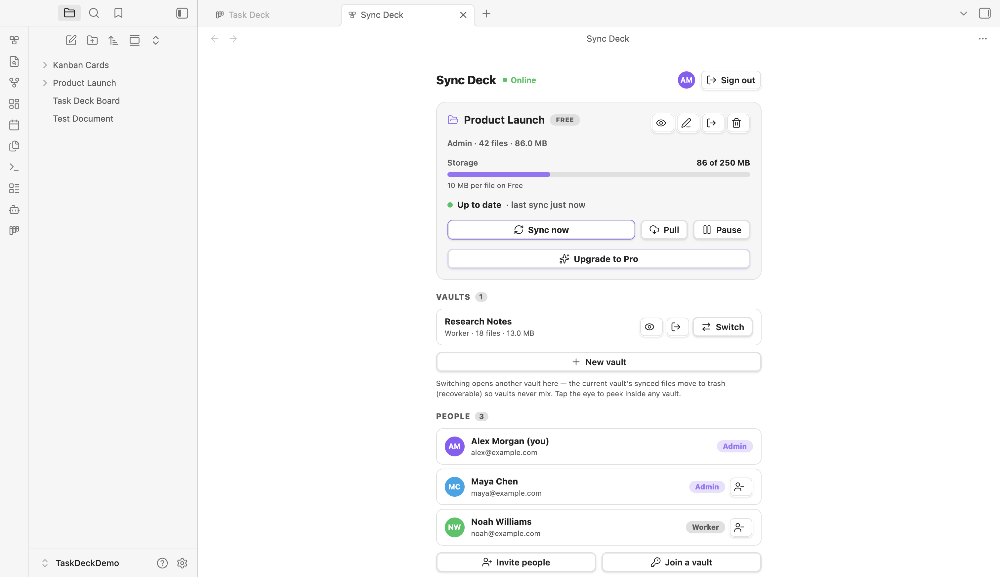
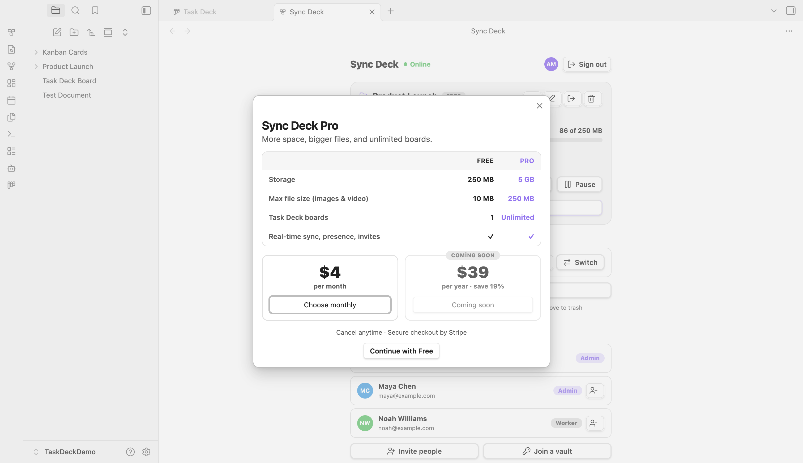

# Sync Deck

[](https://obsidian.md)
[](https://github.com/ismailivanov/sync-deck/releases)
[](LICENSE)
[](https://buymeacoffee.com/carbon06)

Sync Deck keeps an Obsidian vault in sync across your devices and, when you choose, with your team. Sign in with Google, open or create a synced vault, and Sync Deck handles background file sync, recoverable deletes, invites, roles, and live presence.

It is also the cloud companion to [**Task Deck**](https://github.com/ismailivanov/task-deck): Task Deck boards are Markdown files, so Sync Deck can carry them across devices and add collaboration without a separate board database.



<sub>The dashboard uses demo names, addresses, and vault data.</sub>

## Features

- **Google sign-in** with no additional Sync Deck password.
- **Automatic vault sync** for files and folders, plus manual **Sync now** and **Pull** controls.
- **Multiple synced vaults** that can be inspected, opened, renamed, switched, closed, or deleted without mixing their contents.
- **Explicit first sync**: nothing is uploaded until you create or open a vault and choose whether to include the files already on the device.
- **Shared vaults** with invite codes, Admin and Worker roles, a visible member list, and live editor presence.
- **Recoverable file handling**: files removed during a vault switch or leave flow go through Obsidian's trash.
- **Storage visibility** with current usage, per-file limits, sync state, and recent activity in one panel.
- **Task Deck integration** for synced boards, card assignments, and collaborative presence.

## Quick start

1. Install and enable Sync Deck.
2. Open it from the Obsidian ribbon.
3. Read and accept the Terms & Privacy Notice.
4. Continue with Google.
5. Create a synced vault, open an existing one, or join with an invite code.
6. Choose whether the first sync should include the files already in this Obsidian vault.

After setup, local edits are queued in the background. Use **Sync now** for an immediate scan, **Pull** to check the remote vault, or **Pause** when you want to stop syncing temporarily.

## Plans

| | Free | Pro |
|---|---|---|
| Storage | 250 MB | 5 GB |
| Max file size (images, video) | 10 MB | 250 MB |
| Synced [Task Deck](https://github.com/ismailivanov/task-deck) boards | 1 | Unlimited |
| Real-time sync, presence, invites, roles | ✓ | ✓ |

Pro checkout is **$4 / month**. A **$39 / year** option is shown in the plugin when yearly billing is available. The in-app upgrade panel is the source of truth for currently available billing intervals.



## Account, network use & privacy

Sync Deck is a hosted cloud service, so a few things to know up front:

- **An account is required.** You sign in with your Google account; syncing does not work without signing in.
- **Payment is required for Pro.** The free plan works without paying. **Pro** is a paid subscription (see *Plans*), billed through Stripe.
- **Network use.** Sync Deck sends data over HTTPS to:
  - **`api.syncdeck.cloud`** — the Sync Deck backend (hosted in Germany, EU) that stores and delivers the files you choose to sync and powers presence, invites, and roles.
  - **Google** — to sign you in (Sync Deck receives your email, name, and profile picture).
  - **Stripe** — to process Pro payments (your full card details are never sent to Sync Deck).
- **No end-to-end encryption.** Your files travel over an encrypted connection but are stored on the server in a form the operator can technically access. Don't sync passwords, secrets, other people's personal data, or anything you're required to keep confidential.
- **Privacy & terms.** What is collected and your rights (including GDPR and CCPA) are set out in the [Terms of Service & Privacy Notice](TERMS.md). You accept these in the plugin before syncing begins.

## Install

Until Sync Deck is available in the Obsidian community plugin directory:

1. Download `main.js`, `manifest.json`, and `styles.css` from the [latest release](https://github.com/ismailivanov/sync-deck/releases/latest).
2. Put them in your vault under `.obsidian/plugins/sync-deck/`.
3. Enable **Sync Deck** in Obsidian under **Settings → Community plugins**.

Or clone straight into your plugins folder for the latest source:

```bash
git clone https://github.com/ismailivanov/sync-deck.git "/path/to/vault/.obsidian/plugins/sync-deck"
```

## How it works

Sync Deck scans the active Obsidian vault, compares local and remote file state, and transfers changes over HTTPS through `https://api.syncdeck.cloud`. Each synced vault has its own identity, files, membership, and activity. Only one is open in a local Obsidian vault at a time.

When you switch synced vaults, Sync Deck moves the previous vault's synced files to Obsidian trash before opening the next one. This prevents two remote vaults from being merged accidentally and keeps the removed files recoverable.

## Works with Task Deck

[**Task Deck**](https://github.com/ismailivanov/task-deck) is a kanban and table workflow for Obsidian where each card is a Markdown note. Install both plugins to sync board structure, cards, and attachments, assign shared-vault members to cards, and see live presence while teammates work.

## Support

Sync Deck is built and maintained by one developer. If it's useful to you, you can support the work: [Buy me a coffee](https://buymeacoffee.com/carbon06).

## License

[MIT](LICENSE) © Ismail Ivanov
